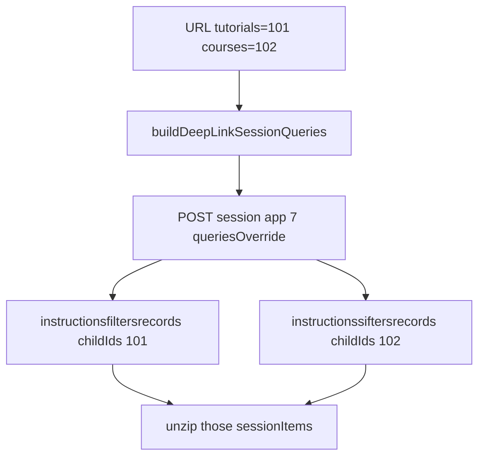

# Drop comms and pin deep-link session queries

## What is wrong today

Deep-link Loading posts **empty `queries`** plus the URL as `search`:

```150:154:src/routes/Loading.tsx
            : {
                search: resolvedSearch,
                webapp,
                convolution: webapp,
              },
```

[`docs/session-first-query-childids.md`](docs/session-first-query-childids.md) says that does **not** pin ids. Session first-load defaults never add `childIds`. `?tutorials=101` in `search` is ignored. A non-empty `queries` map is used as-is; omit any route you do not want.

Fallback is already correct (four take-1 keys, parent `search: "images"` + `parentIds: [0]`). Leave it.

`loadPncContent` in [`contentPipeline.ts`](src/store/thunks/contentPipeline.ts) (used by [`ConvolutionsViewer.tsx`](src/routes/ConvolutionsViewer.tsx) on remount) has the same empty-queries deep-link gap.

You chose **child-only**: only the kinds in the URL, no `dashboardsinstructionsrecords`. Gateway synthesizes the parent session from `metadata.instructionId`.



## 1. Deep-link query builder

Add `buildDeepLinkSessionQueries` next to fallback in [`src/library/fallbackSessionQuery.ts`](src/library/fallbackSessionQuery.ts) (or rename that file to `sessionQuery.ts` if the two helpers sit cleaner together).

From [`getDeepLinkTreeIds`](src/loadingRouteUtils.ts), emit **only** present kinds:

| URL param | Query key | Body |
|---|---|---|
| `tutorials=101` | `instructionsfiltersrecords` | `{ isPrivateView: false, take: 1, skip: 0, childIds: [101] }` |
| `courses=102` | `instructionssiftersrecords` | same shape, `childIds: [102]` |
| `Quizzes=103` | `instructionsdashboardsrecords` | same shape, `childIds: [103]` |

Do not add `dashboardsinstructionsrecords`. Do not invent missing kinds.

Add `childIds?: number[]` to `Executedquery` in [`ThunksUtils.ts`](src/library/ThunksUtils.ts). The type currently has `childIDs` (wrong wire name). Keep sending **`childIds`**.

## 2. Wire fetch on both load paths

In [`Loading.tsx`](src/routes/Loading.tsx) and [`contentPipeline.ts`](src/store/thunks/contentPipeline.ts), the deep-link `fetchData` payload should be:

- `webapp` / `convolution`: `'session'`
- `requestTake`: `1`
- `queriesOverride`: `buildDeepLinkSessionQueries(getDeepLinkTreeIds(resolvedSearch))`
- `search`: `null` (doc: `search` does not contribute ids; empty `queries` + URL search is the bug)

Allow `search: string | null` on `FetchDataPayload` / record bodies. `searchedRoutes` and `counts` are already `null` / `{}`.

Keep unzip flags and post-fetch `unzipMessage` filtering by URL ids as a safety net.

## 3. Drop `commsSlice`

Nothing reads `state.comms`. Unzip is `sessionItems.quote`.

- Delete [`src/store/slices/commsSlice.ts`](src/store/slices/commsSlice.ts)
- Unregister `comms` in [`src/store/index.ts`](src/store/index.ts) and [`src/store/types.ts`](src/store/types.ts)
- In [`validateThenDispatch`](src/library/ThunksUtils.ts): drop `setIncomings` / `setOutgoings` arms, `isIncomingMessage` / `isOutgoingMessage`, and mailbox types on `FetchedData.content`. Keep the session branches.
- Keep [`commsUtils.ts`](src/library/commsUtils.ts) — [`CommentRow.tsx`](src/components/views/CommentRow.tsx) still imports `avatars`
- Delete the stale “commsSlice extraReducers” comment on `updateBosses` / `updateUnderbosses` / `updateMinions` in [`actions.ts`](src/library/actions.ts)

Out of scope: `unzip*Type` settings, incoming/outgoing app indices in `constants.ts` / pagination, videos sibling, studio pager.
